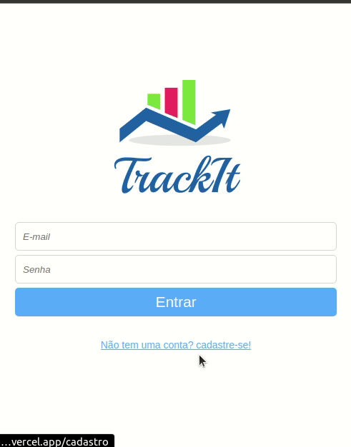

# My Wallet



## About

Habit control application, where you can create, delete and view the history of habits.

## Technologies

<div>
  
  
  
  
  
  
  
   
</div>

## How to run 

- First clone this repository

- Run ```npm i```

- Run ```npm run start```
